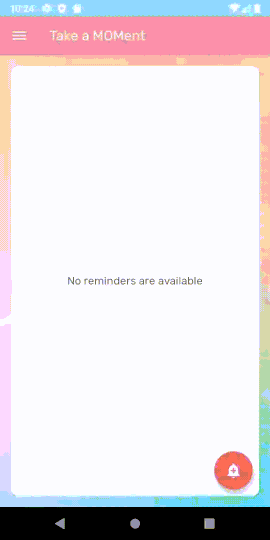

# Take-a-MOMent

## Table of Contents:
* [About](#about)
* [Technology Stacks](#technology-stacks)
* [Environment Setup](#environment-setup)
  * [Android Studio](#android-studio)
  * [Firebase](#firebase)
* [Screenshots](#screenshots)
* [Kanban Board](https://video-store-api.atlassian.net/secure/RapidBoard.jspa?rapidView=3&projectKey=MOM)
 
This is the repository for Take a MOMent, an [Ada Developers Academy Capstone Project](https://github.com/Ada-C13/capstone).

## About
Finding a good time to call mom is always a challenge for people like me who live in different countries with their mom. Most apps only show the current time of a city in a different time zone, and I find it not handy/convenient when I need to schedule calls for a future date/time with my mom who's living overseas.

Take a MOMent is an Android app to help users beat the time differences and find the best time to contact their moms who live overseas. The user can convert the date and time either based on the user's timezone or mom’s timezone. Once the user finds the perfect time base on the built-in time converting tool, a reminder along with an alarm will be created. The application will fire an alarm at the time you set to call mom.

## Technology Stacks
* Android SDK (API level 29) with Kotlin
* Firebase Authentication
* Cloud Firestore

## Environment Setup
### Android Studio: 
1. If you wish to run the app using the emulator, we highly recommend using [Android Studio](https://developer.android.com/studio) as your IDE. 
2. Fork this repository
3. Clone it to your local by clicking “Get from Version Control” on the Android Studio welcome page and provide the URL of your forked repository
4. To set up the emulator, click on Tools > AVD Manager > Create Virtual Device
5. Select Pixel 3 as your hardware
6. Select API level 29 as your image
7. Click Finish to create your emulator
### Firebase:
Two Firebase products were used in this application. Firebase Authentication is implemented to identify users, and Cloud Firestore serves as the database to store users' info and reminders. 
1. If this is your first time using Firebase, [register your Firebase account](https://firebase.google.com/?gclid=EAIaIQobChMI2_fjwf3e6gIVchh9Ch0OQAlIEAAYASAAEgIxyvD_BwE).
2. Click on Firebase Console > Add Project
3. Click on the newly created project on Firebase Console > select the Android icon to add Firebase to the app > follow the instruction 
#### To set up Firebase Authentication:
1. Click on Authentication in the left menu bar
2. Click on the Sign-in method tab and enable the “Email/Password” provider.
#### To set up Cloud Firestore:
1. Click on Database in the left menu bar
2. Click on Create Database > select “Test mode” > follow the instruction
3. Once the database is successfully created, make sure the dropdown next to the Database title is showing “Cloud Firestore” instead of “Realtime Database”
 
## Screenshots
### Sign In/ Sign Up

#### Time Converting and Create a Reminder
The user can convert the date and time either based on the user's timezone or mom’s timezone. A reminder along with an alarm will be created by clicking on the “Create Reminder” button. If you just want to use the time converting tool without creating any reminder and alarm, simply click the back arrow on the top left and back to the homepage.

#### Edit User Profile
Your user info will reflect immediately after you update your profile. You can see your new timezone in the time converting tool right after the update.

#### Delete an Alarm/Reminder
Click on an existing reminder to delete an alarm.

